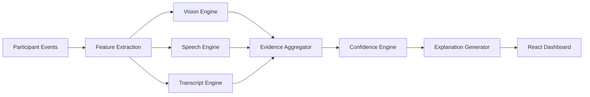

# Sherlock AI

Sherlock AI identifies the most likely interview candidate during live Google Meet, Microsoft Teams, and Zoom sessions by combining many weak signals into a real-time confidence score. The system never depends on a single rule: every prediction is backed by weighted evidence, negative signals, unknowns, and a human-readable explanation.

## Architecture



## Services

- `client`: React, TypeScript, TailwindCSS, Redux Toolkit, React Query, Chart.js, Socket.IO Client.
- `server`: Node.js, Express, Socket.IO, MongoDB repositories, clean architecture services.
- `ai-service`: Python Flask service with modular CV, speech, transcript, and LLM-assisted analysis.
- `shared`: Cross-service TypeScript contracts for participant events, evidence, predictions, and metrics.
- `scripts`: Mock meeting generator and local orchestration helpers.


> **🚀 Real-Time Demo**
>
> **After cloning the repository, navigate to the `shrelock-ai` directory and run the application using `npm run dev`. The project is fully integrated with a real-time data stream powered by Socket.IO, allowing the dashboard to receive and display live participant updates, confidence scores, transcripts, rankings, and evidence without requiring a page refresh.**
>
> **Frontend Dashboard:** `http://127.0.0.1:5173/`
>
> **Backend Health Check:** `http://127.0.0.1:4000/health`
>
> **Once the backend is running, you can verify that the API is operational by visiting the Health Check endpoint. The frontend automatically establishes a real-time connection with the backend and continuously updates the dashboard as new events are streamed.**


## Local Setup

1. Install Node.js 20+ and Python 3.10+.
2. Copy `.env.example` to `.env` and set `JWT_SECRET`. `GEMINI_API_KEY` is optional for local mocks.
3. Install dependencies:

```bash
npm install
cd ai-service
python -m venv .venv
.venv\Scripts\activate
pip install -r requirements.txt
```

4. Start the real-time local demo:

```bash
npm run dev
```

The frontend runs on `http://localhost:5173`, the API on `http://localhost:4000`, and the AI service on `http://localhost:5001`.

For the current local real-time demo, the Node server starts a synthetic meeting adapter that emits Socket.IO updates every three seconds. The dashboard connects to `http://127.0.0.1:4000`, receives `dashboard.updated`, and updates participant cards, transcript, timeline, logs, ranking, and confidence without refreshing.

## Core Prediction Contract

Each extractor emits:

```json
{
  "participantId": "p-001",
  "signal": "display_name_similarity",
  "confidence": 0.86,
  "weight": 0.14,
  "direction": "positive",
  "reason": "Display name closely matches the candidate profile name."
}
```

The confidence engine returns:

```json
{
  "candidate": "p-001",
  "confidence": 0.82,
  "topSignals": [],
  "weakSignals": [],
  "reason": "Selected Priya Sharma because profile metadata, transcript self-introduction, speaking behavior, and camera visibility align.",
  "ranking": []
}
```

## Limitations

This local project ships with mock adapters for Google Meet, Microsoft Teams, and Zoom because those platforms do not expose a common public live media/participant API for arbitrary local interception. Production integration should use approved platform SDKs, bot admission flows, consent screens, and enterprise compliance review. Biometric processing must be opt-in, auditable, and regionally compliant.

## Future Improvements

- Provider-specific meeting bot adapters.
- Stronger diarization calibration per room and microphone topology.
- Resume-aware retrieval with vector search.
- Human feedback loop for post-meeting label correction.
- Privacy-preserving on-device face embeddings.
